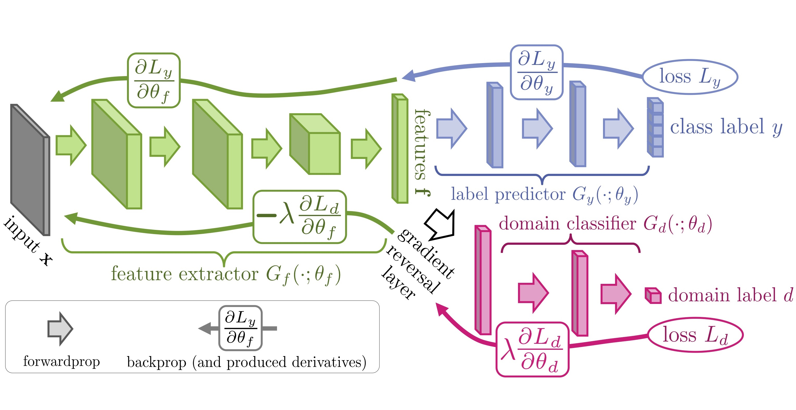

## 데이터

- data pipeline
	- 데이터 입력 파이프라인이란?
		- 현대의 컴퓨터 성능이 좋기 때문에 데이터 훈련 배치를 준비하는 시간보다 데이터를 소비해서 트레이닝 하는 속도가 더 빠른 경향이 있다
		- 즉, 이미지 데이터의 경우 전체를 전처리 하기에는 무겁고 하나하나 읽기에는 너무 많은 지연이 발생할 것이다
		- 따라서 현재 단계를 완료하기 전에 다음 단계를 위해 데이터를 미리 전달할 수 있는 대용량 데이터 입력 파이프라인을 정의해야 한다

	- tf.data API
		- 함수형 프로그래밍의 LAZY LIST와 비슷하며 필요에 따라 호출된다
		- map filter reduce take등의 함수들이 제공되며 제너레이터와 비슷하지만 더 발전된 인터페이스를 제공하고 c++ 백본을 갖추었다
		- 다중 스레드 제너레이터를 직접 구축하는 것보다 더 최적화된 방식으로 구축됨
		- tf.data.Dataset API는 느긋한 리스트 패러다임을 따른다. 예를 들어 다음과 같이 사용한다
		  ```
			  dataset = tf.data.Dataset.list_files(이미지 파일 리스트)
			  def parse_file_to_img(filename):
				  img_bytes = tf.io.read_file(filename)
				  img = tf.io.decode_png(img_bytes, channels=3)
				  img = tf.image.resize(img, [64, 64])
				  return img
			  dataset = dataset.map(parse_file_to_img) # 느긋한 제너레이터임
			  print(ataset.output_shapes)
			  for image in dataset:
				  # 이미지 처리
			  
              # 1. 케라스와 dataset은 호환된다
			  model.fit(dataset, ...)
			  
              # 2. 에스티메이터와도 호환된다
			  def input_fn():
				  return dataset
			  estimator.train(input_fn, ...)
		  ```

	- data pipeline 구축
		- [코드](numpy_and_pandas/data.py)

		1. extraction
			- data가 외부에 있다면
				- scraping
				- crawler

			- data가 내부에 있다면
				- 파일의 소스는 텐서 텍스트 파일 TFRecord 등등
					- 이미 데이터 샘플이 프로그램에 의해 적재되었다면(넘파이, 텐서플로우) .from_tensors()나 .from_tensor_slices()
					  정적 메소드를 통해 tf.data에 바로 전달될 수 있다. 두 메소드 모두 중첩배열이나 텐서를 받아들이지만 .from_tensor_slices()는 데이터를 첫 번쨰 축(데이터
					  제일 내부 최초의 축)을 따라 샘플로 잘라낸다
					- .list_files(목록) 정적 메소드는 목록의 파일 중 하나의 경로를 포함하는 문자열 텐서의 데이터셋 생성
					- .tf.io.read_file()로 각 파일 오픈 가능
					- tf.data.TextLineDataset(): 문서를 한 줄씩 읽을 수 있음
					- tf.data.experimental.CscDataset(): csv를 읽고 줄단위로 반환
					- 매우 다양한 입력 소스로부터 정의될 수 있는데 예를 들어 tf.data.Dataset.range(10), tf.data.Dataset.from_generator(제너레이터),
					  실험적이지만 db로부터 sql 구문으로도 가능하다
				- 파일, 이미지, 데이터베이스
				- big data의 경우 handle by spark

			- data가 부족하거나, 충분해도 편향적이라면
				- augmentation
					- 오프라인 방식, 온라인 방식 결정, 어떤 보강 기법이 유효할지 결정, 레이블과 동시에 변환하기 위해 x, y를 연결 후 보강하고 다시 분리해야 한다
					- 다양한 프레임워크(opencv 등)을 쓰거나, 케라스에서 지원하는 ImageDataGenerator을 쓰거나 tf.image를 쓸 수 있다
					- tf.image 함수를 tf.data 파이프라인 내부에 온라인으로 보강해서 쓰면 좋다

				- rendering from 3d model => merge with proper background => domain transfer
					- 도메인 적응 기법1: 합성 이미지에 소량의 타겟 도메인 데이터를 추가할 수 있는 경우 추가하면 성능이 향상된다
					- 도메인 적응 기법2: DANN
						- 아키텍쳐
						  
					- 도메인 적응 기법3: 렌더링 이미지를 최대한 랜덤으로 다양하게 변형하고 생성
					- 도메인 적응 기법4: 컨디셔널 VAE AND GAN(cGAN, Pix2Pix, CycleGAN, PixelDA 등등) => 논문 리딩 필수

		2. transformation
			- 예를 보는게 제일 좋다
			    ```
				  def parse_fn(line):
					  img_filename, img_label = tf.string.split(line, sep=', ')
					  img = tf.io.decode_image(tf.io.read_file(img_filename))
					  return {'image': img, 'label': tf.string.to_number(img_label)}
				  dataset = dataset.tf.data.TextLineDataset('텍스트 파일 경로').map(parse_fn)
		        ```
			- 모든 이미지 파일을 나열하고 열어서 파싱하는건 너무 많은 자원을 소비
				- 대용량 이미지를 하나의 이진파일에 함께 저장하면 디스크에서 읽어 들이는 연산을 더 효율적으로 한다
				- TFRecoed 파일 포멧이 바로 이것이다. 데이터 샘플을 모으는 이진파일이며 기본적으로 tf.train.Example 인스턴스가 포함되어 있다
				- 예를 들어서 {'img': image_sample1} 이라는 파일이라면
				- tf.train.Example: 각 데이터의 요소를 명명하는 딕셔너리(위에 써둔거)
				- tf.train.Features 인스턴스 또는 서브클래스의 인스턴스: 딕셔너리의 각 요소들: byte, float, int로 저장
				- 텐서플로우를 위해 만든 포멧이라 매우 잘 맞는다
				- tf.data.TFRecordDataset() => tf.train.Example로 반복 => 노트북 분석 ㄱㄱㄱㄱ
			- map을 잘 활용해서 파싱 뿐만 아니라 tf.image.resize(), tf.one_hot() 등으로 편집, augmentation
			- 데이터셋을 섞기, 배치화 등등 역시 메소드를 제공한다
				- .batch() .repeat(count=None) = 무한반복 .shuffle() .filter .take .skip ... 빅데이터의 영향을 받았다
			- 병합
				- .concatenate(), .zip()등이 있다 zip은 데이터셋의 요소들끼리 튜플로 결합시킨다
				- .interleave(map_func, cycle_length, block_length, ...): 걍 문서 더 찾아보자ㅜㅜㅜㅜ

		3. load
			- 딱히 할게없다

		4. 데이터셋 모니터링 및 재사용
			- 모니터링: 잘하자
			- 캐시: 메모리를 고려해서 주의깊게 쓰자

		5. 데이터 파이프라인 모범 예시
			1. 위에서 다룬 대부분 메소드가 병렬화 없이 샘플을 하나씩 처리하지만 다중 cpu 코어를 활용해서 멀티 프로세싱으로 병렬처리 할 수 있다
				- 예를 들어 .inter_leave() 혹은 .map() 등은 num_paralles_calls 매개변수로 스레드 수를 지정할 수 있다
			2. 데이터 샘플을 프리패치할 확률이 있다. .prefetch(버퍼사이즈) 는 현재 샘플이 소비되는 동안 다음 데이터셋 호출을 기다리지 않고 먼저 샘플을 준비한다. 텐서플로우는 이렇게 gpu
			   모델이 실행중인 동안 cpu에서 다음 훈련 배치를 미리 준비한다
			3. 프리패치 메소드는 생산자 소비자 방식으로 데이터 준비 및 훈련 연산을 병렬화할 수 있다
				- 예를 들면 cpu에서 병렬로 이미지를 map하고 gpu에서 train할 때 또 cpu에서 미리 map하고
			4. 전역 옵션 설정도 가능
			   ```
				 options = tf.data.Options()
				 options.experimental_optimization.map_and_bath_fusion = True
   				 options.experimental_autotune = True => 병렬값 알아서 튜닝
                 dataset = dataset.withOptions(options)			   
			   ```

- data visualize
	- pandas
	- seaborn
	- matplotlib
	