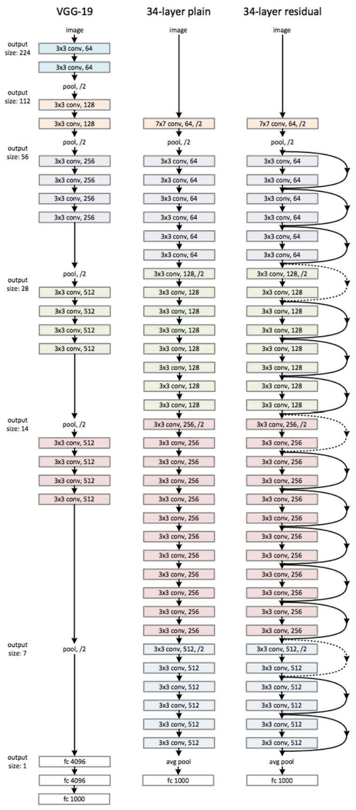

- computer vision
	- classification
		- lenet5
			- 아키텍쳐
			  
			- [논문](./image_classification/lenet5/lenet5.pdf)
			- [코드](./image_classification/lenet5/lenet5.py)

		- alexnet
			- 아키텍쳐
			  
			- [코드](./image_classification/alexnet/alexnet.py)
			- lenet보다 더 크고 깊은 신경망을 사용했다

		- vggnet
			- 아키텍쳐
			  
			- [논문](./image_classification/vggnet/vggnet.pdf)
			- [코드](./image_classification/vggnet/vggnet.py)
			- 알렉스넷의 부족한 점들을 보완했다
				- 알렉스 넷의 특징: 렐류 도입, 드롭아웃 적용, 콘볼류션과 DENSE를 결합한 구조, 이미지 어그멘티드 사용
			- 장점
				- 규모가 큰 합성곱을 규모가 작은 여러개의 합성곱으로 대체했다
					- 3 * 3의 커널을 같는 CONV 계층을 2개를 쌓으면 5 * 5의 커널을 가지는 하나의 CONV 계층과 동일한 수용 영역을 가진다
					- 알렉스넷의 필터 크기는 11 * 11까지도 존재했으나, VGG는 작은 크기의 합성곱 계층을 써서 더 큰 ERF를 얻었다
					- 11 * 11의 필터를 사용하는 경우 n개의 필터를 쓴다면 파라미터의 수는 11 * 11 * N * D
					- 이를 3 * 3 필터 계층 5계층을 사용하면 3 * 3 * N * D + 4 * (3 *3 * N * N)
					- 따라서 N < 3.6D이면 무조건 더 적은 파라미터를 쓰게 되는데, 이는 거의 당연한 ㅇ야기
					- 또한 여러 합성곱 계층 내부의 여러 비선형 함수를 거쳐서 비선형성은 증가
				- 특징맵 깊이를 매 계층마다 2배
				- 마지막의 밀집계층을 합성곱 계층(FULLY CONVOLUTIONAL NETWORK)으로 바꾸었다(중요)
					- 이 방법으로 이미지의 크기에 무관하게 모두 훈련이 가능해 졌다

		- googlenet
			- 아키텍쳐
			  
			- [논문](./image_classification/googlenet/googlenet.pdf)
			- [코드](./image_classification/googlenet/googlenet.py)
			- 구글은 VGG넷보다 매개변수가 12배나 더 작고 더 강력한 성능을 내서 1위를 차지했다
			- 원시적인 인셉션 블록을 업데이트해서 9개의 인셉션 블록을 사용했다
				- 3가지 종류의 합성곱 계층과 1개의 맥스풀링 계층을 사용해서 블록 내부를 4개의 병렬 네트워크로 구성했다
				- 나온 4가지 병렬 처리 결과를 CONCATNATE하는 것만으로 비선형성이 증대했다
				- 어떤 커널의 크기가 적당한 크기인지 직접 세팅할 필요가 없게 되었다. 모든 커널의 크기에 대해 최선의 결과를 네트워크가 스스로 찾는다

		- resnet
			- 아키텍쳐
			  
			- [논문](./image_classification/resnet/resnet.pdf)
			- [코드](./image_classification/resnet/resnet.py)
			- 인셉션 네트워크는 네트워크의 깊이보다 크기를 키우는 것이 더 유효한 전략임을 중명했다
			- 그러나 여전히 많은 연구자들은 깊이를 키우는 방식으로 더 복잡한 작업을 풀고자 했다
			- resnet은 이러한 깊이 증가 방식의 네트워크로 학습이 더 쉬워질 수 있음을 증명했다
			- 일반적으로 더 깊은 네트워크를 쌓으면 성능이 오히려 떨어지게 된다. 이는 이 문제가 단순한 과적합 문제는 아니라는 뜻이다
			- 만약 원래의 cnn에 어떤 레이어를 추가하고 동일한 성능이 나온다면, 추가한 레이어는 항등 매핑을 학습했을 것이다
			- 그런데 레이어를 추가해서 성능이 떨어진다는 뜻은 추가한 레이어가 항등 매핑을 학습하는 것 마저도 어렵다는 뜻이다
			- 따라서 어떤 추가 레이어가 항등 매핑을 학습할 수 있다는 것이 보장된다면 그 네트워크는 최소한 추가하기 전의 성능 이상을 보장한다

	- clustering
		- siamese-net
		- face-net

	- object detection
		- 성능 평가 기준
			- 경계 상자 정밀도: 정확한 크기의 경계 상자인가?
			- 재현율: 모든 객체를 찾았는가?
			- 클래스 정밀도: 객체마다 정확한 클래스를 찾았는가?
			- 속도가 빠른가?

		- yolo v3
			- 아키텍쳐
			  
			- [yolo v1 논문](./object_detection/yolo_v3/yolo_v1.pdf)
			- [yolo v3 논문](./object_detection/yolo_v3/yolo_v3.pdf)
			- 장점
				- 속도가 빠르다
				- 객체 탐지를 단일 리그레션 문제로 재구성했다. 즉 슬라이딩 윈도우와 같은 복잡한 기법 대신 그리드로 분할
			- 단점: 작은 크기의 물건을 탐지하는데 어려움이 존재해서 정확도가 떨어진다

			- cnn 아키텍쳐로 이루어진 백본(특징 추출기)을 사용한다
			- 백본의 마지막 계층이 w * h * D의 특징 텐서를 출력한 경우 w * h를 그리드 셀의 개수로 해석한다
			- 이제 D차원의 깊이를 M차원의 깊이로 변환하기 위해서 1 * 1 컨볼루션 연산을 사용한다
				- 이 때 M = B * (C + 5)인데, B는 그리드 셀당 경계 상자의 개수, C는 분류하고자 하는 클래스의 개수를 나타낸다
				- 즉, 모든 각각의 그리드 셀에는 B개의 경계상자가 존재하고, 각각의 경계상자는 C+5개의 숫자를 예측해야 한다
				- C + 5개의 숫자는
					- 담당하는 경계상자의 중심좌표 x, y
					- 경계상자의 높이 w, h(이 값들은 원본 이미지를 활용해서 0-1 사이의 값으로 표현한다)
					- 탐지하고자 하는 임의의 객체가 이 경계상자 안에 있다고 확신하는 신뢰도 c
					- 탐지하고자 하는 임의의 객체가 이 경계상자 안에 있다고 전제할 때, 각각의 클래스에 대한 C개의 확률
			- 위의 방법으로 w * h * B개의 경계 상자 벡터가 얻어지며, 각각의 경계상자는 (C + 5)차원 벡터로 나타난다
			- 즉, 최종 출력은 w * h * B * (C + 5)로 이루어진 4차원 텐서가 출력된다

			- 앵커박스 방법론 도입
				- x y w h를 직접 출력하던 yolo v1에서 객체의 크기가 다양하기 떄문에 문제가 된다는 것을 깨닫게 되었음
				- 훈련 데이터 셋에서 객체가 대부분 크다면 w, h가 원래 매우 크다고 예측하기 때문에 실제 데이터에서 실패하는 경우가 많다
				- yolo v2에서는 네트워크를 훈련시키기 전에 결정하는 일련의 앵커박스를 정의했다
				- 3~25개의 다양한 형태의 앵커박스를 데이터를 훑어보고 미리 결정한 후 훈련 과정을 통해 앵커박스 크기를 조절한다
					- pw ph는 앵커박스 원래 크기, cx cy는 현제 그리그 셀 좌표
					- bx = sigmoid(tx) + cx
					- by = sigmoid(ty) + cy
					- bw = pw * exp(tw)
					- bh = ph * exp(th)

			- 확실한 경계상자만 남기기 위해 2가지 과정을 차례대로 거친다
				- 경계상자 사후처리: 경계상자 하나하나가 자신만의 결론을 낸다
					- 하나의 경계 상자에 대해서 신뢰도 c와 C개의 클래스 확률을 모두 곱한다
					- 정해둔 임계값 이하의 모든 클래스 확률을 0으로 만든다
					- C개의 클래스 확률에서 0이 아닌 값이 남아있다면 최대 확률의 클래스를 해당 경계상자의 클래스로 선택한다
				- NMS: 최고의 경계상자를 제외한 나머지 모든 경계상자를 제거한다
					- 여전히 w * h * B개의 경계상자가 남아있다
					- 각각의 경계상자는 자신만의 예측 클래스와 그에 따른 최대 확률을 가지고 있다
					- C개의 클래스중에서 하나의 클래스를 선택하고
					- 선택한 클래스를 자신의 예측으로 하고 있는 모든 경계 상자를 모아서 클래스의 최대 확률 순서로 정렬한 후
					- 최대 확률을 가지는 경계 상자와 많이 겹치는(IoU가 임계값 이상으로 높은) 상자는 모두 제거한다
					- 모든 클래스에 대해서 이를 반복한다

			- loss: 경계 상자 손실 + 객체 탐지 신뢰도 손실 + 클래스 분류 손실
				- 경계 상자 손실 = 람다 * 시그마 (1obj_ij * 경계 상자 중심 좌표 손실) + 람다 * 시그마 (1obj_ij * 경계 상자 크기 손실)
					- 람다: 경계 상자의 중심 좌표 또는 경계 상자 크기에 대한 중요도를 결정하는 하이퍼 파라미터
					- 1obj_ij: i번째 그리그 j번째 경계 상자에 해당 obj를 탐지하면 1, 아니면 0
					- w와 h에 대해서는 제곱근을 씌워서 계산: 크기가 작은 경계 상자에 대한 오차를 크기가 큰 상자의 오차보가 더 크게 패널티
				- 객체 탐지 신뢰도 손실 = 람다 * 시그마 (1obj_ij * 객체 탐지 신뢰도 손실) + 람다 * 시그마 (1no_obj_ij * 경계 상자 크기 손실)
					- 이 부분 다시 확인!!!!!!!!!!!!!!!!!!!!!!!!!!!!!!!!!!!!!!!!!!!!!!!!!!!!!!!!!!!!
				- 클래스 분류 손실

		- faster-r-cnn
			- [논문](./object_detection/faster_r_cnn/faster_r_cnn.pdf)

			1. rpn(영역 제안)
				- roi를 생성한다
				- 입력 이미지 > cnn 백본 > 특징 맵 w * h * d를 얻는다
				- 3 * 3 영역마다 3 * 3 * d 필터를 256개 사용해서 각 필터 적용 영역마다 1 * 256 벡터를 얻은 후 2개의 1*1 합성곱을 사용
				- 각각의 합성곱으로 k의 경계상자에 대해서 2개의 객체성 신뢰도 점수, 4개의 상자 위치 관련 부동소수점을 얻는다
			2. 분류
				- 앞에서 계산했던 특징 맵 + roi 리스트를 받는다
				- 원본 이미지 좌표계로 생성된 roi를 특징 맵 좌표계로 전환한다(원본 이미지와 특징맵의 보폭이 16이면 16으로 나누면 된다)
				- 각 roi 크기를 조정해서 s * s * d의 특징맵으로 조절한다(크기를 일정하게 한다)
					- 조정하기 위해 roi 풀링을 수행한다(비율을 맞추어 2*2 > 1*1과 같은 방식으로 셀의 최대값만 취해서 사이즈를 줄인다)
					- 이 방법으로 Faster 되었다
				- dense 레이어를 써서 1*1*512 벡터를 얻는다
				- 2번의 서로 다른 1*1 합성곱을 써서 C개의 클래스 분류 확률과 4개의 경계상자 개선

			3. 레이블과 로스 구성
				- rpn 레이블 구성
					- 각 이미지마다 특징맵의 크기그 w h d인 경우 w * h * k개의 roi를 얻게 된다
					- 이미지의 대부분은 배경이기 때문에 이 네트워크는 제안한 대부분의 roi가 배경이라고 학습된다
					- 따라서 이 문제를 해결하기 위해 샘플링 기법을 선호한다
					- 256개의 실제 앵커박스의 미니배치가 구성되고 이 중 128개는 객체 포함, 128개는 미포함으로 레이블을 구성
				- rpn 로스 => 구글링!!!!!!!!!!!!!!!!!!!!!!!!!!!!!!!!!!!!!!!!!!!!
				- 분류 로스 => 구글링!!!!!!!!!!!!!!!!!!!!!!!!!!!!!!!!!!!!!!!!!!!!
				  4 훈련 방법

				1. rpn의 훈련을 통해 roi를 먼저 예측하도록 한다
				2. rpn의 출력을 통해 분류 파트를 훈련시킨다 > 서로 다른 합성곱 가중치를 가지게 된다
				3. rpn의 cnn 백본을 분류 파트의 cnn 백본으로 교체하고 cnn을 고정시킨 다음 rpn을 재훈련
				4. rpn의 출력을 통해 분류 파트를 재훈련

			- 장점: yolo에 비해 느리지만 정확도가 높다

	- object segmentation
		- encoder and decoder architecture
		- operations for decode cnn
			- transposed convolution = deconvolutional
				- 원래 컨볼루션: h' = ((h - k + 2p) / s) + 1, w' = ((w - k + 2p) / s) + 1
				- transposed convolution: 위의 식을 역으로 한다

				1. 입력 x를 d(= s = 역으로 돌리고자 하는 컨볼루션의 보폭) 의 비율로 팽창
				2. p'(= k - p - 1)으로 패딩
				3. 합성곱 수행

				- tf.keras.layers.ConvdTranspose()
				- 보폭을 1 이하로 적용하는 합성곱과 같다

			- dilated convolution
				- 데이터 차원을 늘이거나 줄이지 않고 필터의 수용영역만을 증가시키기 위해 사용

				1. 입력 x를 1로 패딩
				2. 필터 w를 d로 팽창
				3. 합성곱 수행

				- tf.karas.layers.Conv2D(dilation_rate를 1 이상으로 하면 됨)

			- unpooling
				- 오리지널 풀링때의 마스크를 기억해 둔 후에 언풀링 연산에 적용시킨다
				- 평균 언풀링 연산을 업샘플링이라 부르고 자주 사용된다
				- tf.karas.layers.UpSampling2D()

		- how to segmentation objects?
			- fcn = fully convolutional networks
				- [논문](./object_segmentation/fcn.pdf)
				- vgg16 아키텍쳐에 기반
				- fcn 32s > fcn 16s > fcn 8s 순서로 발전
				- 이전 계층과 결합할 때 덧셈 연산을 사용한다

			- u-net
				- [논문](./object_segmentation/u_net.pdf)
				- 이전 계층과 결합할 떄 concat 연산을 사용한다

			- 디코더 부분에서 출력 계층을 원본 이미지의 H, W 그리고 분류하고자 하는 클래스의 개수 N으로 해서 픽셀 단위로 classification
			- 채널축을 따라 argmax 하면 된다
			- 픽셀 단위 분류 문제에서는 데이터의 불균형 문제가 반드시 나타나고 이를 보완하기 위해 이미지를 편집할 수 없다
			- 어떤 객체는 모든 이미지에 나타나지만 크기가 작아 픽셀 수가 작고, 어떤 이미지는 또 너무 커서 이미지 대부분을 차지할수도 있다
				- 이를 위해 손실함수를 조정해야 한다. 즉 각 클래스의 cross entropy 손실에 대한 기여도를 측정한다. 예를 들면 클래스의 이미지 크기가 작을수록 손실에 대한 가중치를 크게
				  한다
				- 이를 위해 레이블 맵으로부터 가중치 맵을 직접 설정해야 한다
			- 다른 방식으로 클래스 비율에 아무 영향이 없는 손실함수를 생각해볼 수 있다
				- IoU 또는 다이스 계수와 같은 지표를 사용할 수 있다
				- Dice(A, B) = 2|A OR B| / |A| + |B|
				- 따라서 다이스 계수는 각 클래스에 대해 예측한 마스크가 실제 마스크와 얼마나 겹치는지를 측정하는 지표가 될 수 있다
				- 다이스 계수는 0-1 사이의 값인데, 네트워크는 손실을 최소화 해야 하니까 다이스 계수의 역수를 손실 함수로 사용하면 된다
				- L = 1 - (Dice(y, a)) / N, where Dice(a, b) = 원래의 다이스 계수 정의 분모 분자에 입실론 추가
			- CRFs 기법을 사용해서 부정확한 윤곽들을 후처리

		- how to segmentaion instances?
			- mask-r-cnn
			- faster r cnn으로 일단 roi를 제안하고 그 roi 안에서 분류네트워크랑 분할마스크 네트워크를 분기처리한다
			- faster에서 추가된 분할 네트워크는 한쌍의 표전 합성곱과 전치합성곱으로 구성된다
			- 분할 네트워크가 예측한 n개의 이진 마스크에 대해 분류 네트워크가 예측한 클래스에 대응하는 마스크만 예측 및 loss를 계산하도록 사용

	- analyze sequential image(video)
		- 샘플링 vs 장면추출
		- 동작감지, 다음 프레임 예측, 슬로우 모션, 객체 추적 등등의 어플리케이션
		- cnn으로 특징벡터를 뽑은 다음 rnn에 태울 것인데 cnn을 미세조정하지 않고 freeze 해서 언제나 같은 특징벡터를 만들도록 하고 이를 캐시해서 쓸 것임
		- 따라서 우선 모든 영상에 cnn으로 특징 벡터를 뽑아 케시에 저장하고 그 후에 lstm에서 훈련
		- inception을 쓰는 경우 최대 글로벌 풀링 영산을 해서 결과를 1*1*2048로 확줄여버린다(왜냐면 동작을 분류하려고 하는 경우 공간정보가 무의미하기 때문)
		- 모든 영상이 같은 프레임은 아니며, 프레임이 짧은 영상에 대해 패딩을 시행해서 같은 길이로 맞춘다
		- 모든 프레임을 사용하지 않을 것이기 때문에 3가지 옵션중 하나를 택해서 프레임을 추출한다
			- 1초당 N개의 프레임만 추출: 패딩이 많은 경우 대부분 0인 프레임이 많아져서 별루
			- 전체 프레임에서 N개 프레임을 샘플링: 이게 낫다
			- 장면으로 동영상을 분할하고 장면당 N개 샘플링
		- 노트북을 읽어보자