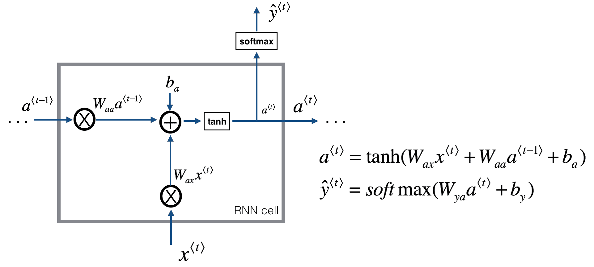

- neural network
	- [linear regression](./nn)
	- [perceptron](./nn)
	- [multi layer perceptron](./nn)
	- [logistic regression](./nn)
	- [dnn](./dnn)
	- [cnn](./cnn)
		- 장점
			- 지역성 반영
			- 작은 네트워크 사용으로 매개변수 숫자 감소
			- 이미지의 크기와 차원에 무관하게 알고리즘이 작동함
		- 유효 수용 영역 ERF
			- 유사 가우시안 분포를 따른다
			- 출력 계층의 뉴런이 입력 계층의 중앙에 있는 픽셀에 담긴 정보를 더 많이 수용
			- 사람의 눈도 비슷한 방식으로 작동
	- rnn lstm gru
	  
	  
		- bptt 계산
		- bptt에 의해 계산 복잡도가 높고 경사가 소실되거나 폭팔할 위험이 크다
		- 그래디언트 문제로 인해 과거의 정보가 손실될 확률이 높으므로 해결하기 위해 lstm 등장
		  
		  
		- bptt 텀에서 망각게이트의 항이 1이 ㄱ까운 경우 정보가 셀끼리 더 잘 전달된다

	- support vector machine
	- naive bayes classifier
	- random forest

	- optimize theory
		- data preprocess
			- computer vision data
				- normalize
				- whitening
				- structure
					- stochastic
					- stochastic mini batch
					- batch
			- natural language data
				- 정리중...

		- regularize
			- [코드](./neural_network/variations_of_regularize_by_lenet5.py)
			- L1 regularize
				- 덜 중요한 피쳐에 대해 연결된 매개변수 W가 0으로 축소된다
				- 즉 노이즈에 가까운 피쳐에 대해 무시함으로서 과적합을 방지함
				- 희소 매개변수를 취하게 만들고 네트워크의 용량이 최소화돼야 하는 모바일 어플리케이션으 ㅣ경우 적합
			- L2 regularize
				- 인풋의 커다란 값을 제어하는 가중치에 대해 크게 처벌해서 정규화
			- dropout
			- batch normalization
				- [논문](./paper/batch_normalization.pdf)
				- covariant shift 문제를 해결하려고 제안된 논문
				- 후에 제안된 논문에 의해 실제로는 regularize 문제를 해결한 것으로 밝혀짐
			- early stopping
				- 교차 검증을 조기 중단의 근거로 쓴다
				- 일반적으로 검증 손실과 메트릭을 모니터링 하고 최고 수준을 보였던 수준에서 가중치 복원
				- 즉 가중치를 정기적으로 저장하도록 코드를 짜야 함
				- 이러한 작업은 케라스의 콜백으로 지원딤

		- gradient descent
			- [코드](./neural_network/variations_of_optimizer_by_lenet5.py)
			- sgd
			- momentum
			- nesterov momentum
			- adagrad
			- rmsprop
			- adam
			- burn in: 손실 폭팔을 위해 초기에 학습률을 감소시킴?

		- model evaluation and selection
			- cross validation

			- accuracy

			- ap 임계값
				- 참긍정수 거짓긍정수 거짓부정수라는 값을 결정하기 위해서는 언제 예측과 실제가 일치인지 아닌지 판단하는 기준이 필요하다
				- 두 집합이 얼마나 겹치는지를 측정하는 자카드 지표, 즉 IoU를 활용한다
				- IoU = 교집합 원소의 개수 / 합집합 원소의 개수
				- AP를 계산할 때, 일반적으로 IoU가 0.5를 넘으면 두 집합이 겹친다고 표현

			- precision: 참긍정수 / (참긍정수 + 거짓긍정수): 맞춘 true / 예측한 모든 true

			- recall: 참긍정수 / (참긍정수 + 거짓부정수): 맞춘 true / 진짜 true

			- precision-recall curve
				- 신뢰도 임계값 T마다 각각 정밀도와 재현율을 모두 검사하고 그래프로 나타낸 곡선
				- 모델은 모든 경계 상자에 대해 예측을 얼마나 확신하는지 0-1 사이의 신뢰도 숫자로 출력한다
				- 신뢰도가 T보다 낮은 모든 예측은 고려 대상에서 제거한다
				- T가 1에 가까우면 정밀도가 높지만 재현율이 낮다.
					- 정밀도가 높으면 긍정이 틀렸을 경우의 수가 낮아지지만
					- 놓치는 객체가 많아져서 부정이 틀렸을 경우의 수가 높아진다
				- T가 0에 가까우면 정밀도는 낮지만 재현율이 높다
				- 트레이드 오프를 결정해야 한다.
					- 자율주행이라면 보행자 탐지를 위해 recall이 높아야 한다
					- 투자라면 투자를 조심하기 위해 정밀도가 높아야 한다

			- AP mAP
				- 정밀도 재현율 곡선의 아래 부분의 영역 넓이를 AP, 즉 평균 정밀도라고 전체 넓이 1의 부분이어서 0과 1 사이의 값을 가진다
				- AP는 단일 클래스에 대한 모델 성능 정보를 제공한다
				- 전역 점수를 위해서 mAP, 즉 모든 클래스에 대한 AP의 평균을 사용한다

			- f1 score

		- transfer learning
			- 사전 훈련된 작업에서, 데이터가 적어 분포를 추정하기 어려운 다른 작업으로
			- 사전 훈련된 도메인에서, 데이터가 적어 분포를 주청하기 어려운 다른 도메인으로 = 도메인 적응
			- 훈련 샘플은 부족하지만 목적하는 데이터보다 더 크고 유사한 데이터셋에 접근할 수 있는 경우
				- 예를 들어 개와 고양이를 구분해야 하는 경우
				- 개와 고양이 사진이 충분하지 못한 경우 ImageNet과 같은 커다란 데이터셋에서 먼저 훈련
				- 마지막 계층을 제거하고 cnn 계층은 고정시켜서 데이터 범위를 축소해서 재훈련
				- 여기에서 cnn 계층을 고정하지 않으면 데이터의 숫자가 적어서 과적합이 발생할 수 있다
			- 훈련 샘플이 풍부한 경우는 과적합될 확률이 낮으므로 기존에 훈련된 모델의 cnn 계층을 고정시키지 않고 대부분 미세조정한다
				- 이는 새롭게 훈련하고자 하는 데이터가 작업적으로 유사하거나 비슷한 도메인일 때 유효하다
			- 훈련 샘플이 부족하고 사전 훈련 가중치도 별 의미가 없는 경우
				- cnn의 첫 번째 계층만 사용해서 저차원의 특징만 반영하는 계층을 활용할 수 있다
				- 여기에 분류기를 추가하고 미세조정
			- frozen
			- fine-tuning
			- domain adaptation